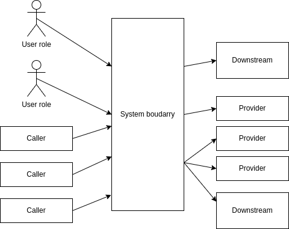
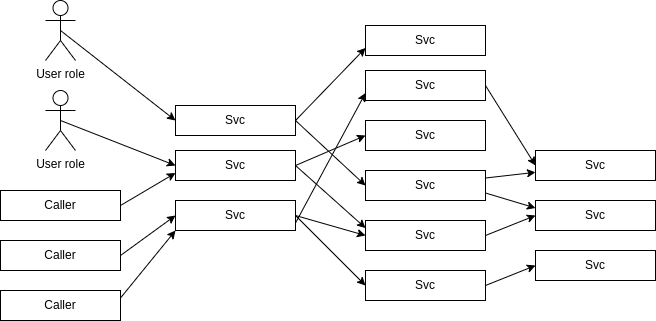

# Introduction

> *A single dramatic software failure can cost a company millions of dollars - but can be avoided with simple changes to design and architecture.*

This page presents what I've understood, what I thought of specific topics and my personal notes on a book that targets architects, designers and developers of distributed systems (including websites, web services and EAI projects (among others)).
For instance,

1. When the main website is down, new clients cannot be targeted and existing customers won't be able to catch necessary information.
2. When web services or the Enterprise Application Integration (EAI) system is down, data flow will not work as intended and will surely increase support, block employees in doing what that are payed for and everyone will have to go home for a day because softwares have stopped working accordingly.

Based on available resources, we need to design systems that operates at low cost and high quality: **the goal is to build softwares that are cheap to build, good for users and cheap to operate**, by requesting little to no time when an evolution or new functionality is needed, and evolves according to continuous techniques and state-of-the-art methodologies.

# Create stability

> *Bugs will happen. They cannot be eliminated, so they must be survived instead.*

Inside every enterprise today is a mesh of interconnected, interdependant systems.
The cannot - must not - allow bugs to cause a chain of failures, by propagating from one system to all other systems.

"Stability" is created when we prevent bugs from affecting everything else by designing a robust system that keeps processing transactions, even when transient impulses, on persistent stresses, or when component failures dirupst normal processing. _It's not just that your individual servers or applications stay up and running, but **rather that the user can still get work done**._

* **Extending your life span**. The major dangers to your system's longevity are memory leaks and data growth. Both kinds of sludge that kill your system in production, despite rarely being caught  on anything else than production: the trouble is that applications never run long enouth in the development environment to reveal their longevity bugs. These kind of bugs are not caught by load testing either, as a load test runs for a specified period of time. The only solution is to run your own longevity tests. [26]
* **Failure modes**. Sudden impulses and excessive strain can both trigger catastrophic failure. In either case, some component of the system will start to fail before everything else does. Once you accept that failure will happen, you have the ability to design your system's reaction to specific failures, by creating failure modes that contain the damage and protect the rest of the system. This sort of self-protection determines the while system's resilience. These *crumple zones* allow to decide what features of the system are indispensable and build failure modes that keep cracks away. If you do not design your failure modes, than you'll get whatever unpredictable - and usually dangerous - ones happen to emerge.
* **Stopping crack propagation**. This is probably the most complicated thing to anticipate, as it needs to have a good feeling of what could go wrong. And actually, *anything* could go wrong, from the OS to the database connection, code exception that is not well caught, ...

## Stability antipatterns

First, we can analyse some _antipatterns_, to have a better idea of what can go wrong, and how to anticipate their failures.

### Chain of failures

One small issue lead to another, which lead to another, and so on.
If you try to estimated the probability of that exact chain of events occuring, it would look incredibly improbable.
But it looks improbable only if you consider the probability of each event individually: the combination of events that cause a failure is not independent: a failure in one point or layer actually increases the probability of other failures. Because layers are coupled, these events are not independent : if a database gets slow, the application servers are **most likely** to run out of memory.

One way to prepare for every possible failure is to look at every external call, I/O, use of resources and expected outcome, and ask: *"What are all the ways this can go wrong?"*
Think about different types of impulse and stress that can be applied :

* What if I can't make the initial connection ?
* What if it takes ten minutes to make a connection ?
* What if it can make the connection, and then get disconnected ?
* What if it doesn't get a response from the other end ?
* What if it takes two minutes to respond to my query ?
* What if 10.000 requests come in at the same time ?
* WHat if the disk is full when the application tries to log a message ?

It is not possible to have an exhaustive list of everything that could go wrong.
**One thing is sure: faults will happen**. They can never be completely prevented.

An obvious example is a database failure: if an entire database cluster goes dark, then any application that calls the database is going to experience problems of some kinds.
What happen next depends on how the caller is written: **preventing cascading failures is the key to resilience**.

### Integration points

Every new application is an integration project with some combination of HTML, front-end apps, mobile app, API, or all of the above.
The context diagram for any project will fall between one of these two patterns:

* The *butterfly* has a centralized system, with a lot of feeds and connections fanning int o on one side, and a large fan out on the other side.

* The *spiderweb* is a style with many boxes and dependencies. If you've been diligent, the calls will soap through boundaries and layers before being sent to a new layer. If not, the web will be chaotic. The feature common to all of these is that the connecions outnumber the services. A butterfly has 2N connections; a spiderweb might have up to 2^N, and yours falls somewhere in between.

**All these connections are integrations points, and every single one of them is out to destroy your system.**
The more you move toward a large number of smaller devices, the more we go API first, the worse this is going to get.

The simplest failure mode occurs when the remote system refuses connections: the calling system must deal with connection failures.
This shouldn't be a problem, since every programming language allows to deal with this kind of error...
What could take time, though, is to discover that you can't connect; for example when the destination server is hammered with connection requests.
For instance, when using socked-based connection, the port itself has a "listen queue" that defines how many pending connections (SYN sent, but no SYN/ACK replied) are allowed by the network stack.
Once that listen queue is full, further connection attempts are refused quickly.
The worst place is to be **in** the listen queue, as it can takes more than ten minutes for the sender to realise that there was a problem.

Network failures can hit you in two ways: fast or slow.

* Fast network failures cause immediate exceptions in the calling code, in the form of a *connection refused*, it takes a few milliseconds to come back to the caller.
* Slow failures such as a dropped ACK, let threads block for minutes before throwing exceptions. The blocked thread can't process other transactions, so overall capacity is reduced. If all threads are blocked, then the server is down.

The most effective stability patterns to combat integrations points failures are *Circuit breaker* and *Decoupling middlewares*.
Other defensive patterns are *Timeouts* and *handshaking*.

### Users

As traffic grows, it will eventually surpass your capacity.
How does your system react to excessive demand ? If you're running in the cloud, then autoscaling is your friend.
It's not hard to up a huge bill by autoscaling buggy applications.

**The best thing to defense against users is to test agressively**, as some users might want some things that are expensive to serve.
Remember that users consume memory: each user session requires memory. Minimize that footprint to improve your capacity (_"capacity" is the maximum throughput your system can sustain under a given workload while maintaining acceptable performance_: when a transaction takes too long to execute, it means that the demand on your system exceeds its capacity).

### Infrastructure (73)

> If you have little time to prepare, you can either set aside a portion of your infrastructure or provision new cloud resources to handle the promotion or traffic surge.
> This works only if the extraordinary traffic is directed at a portion of the system.
> In this case, event if the dedicated portion melts down, at least the rest of the system's regular behavior is available.
> The adivce is to "pre-autoscale" by upping the configuration before the marketing event goes out.

As the number of servers grows, then a different communication strategy is needed: depending on your infrastructure, you can replace point-to-point communication with one of the following: UDP broadcasts, TCP or UDP multicast, Publish/subscribe messaging or message queues. Of course, the more complex you go, the more it comes at a serious infrastructure cost.

If you provide a service, you would expect a "normal" workload, but rather a to serve unpredictable users, with high demands at the worst moment.
To improve this,

1. Use capacity modeling, to make sure you're at least in the ballpark
2. Don't just test your system with your usual workloads: see what happens if you take the number of calls the front end could possibly make, double it, and direct it all against your most expensive transaction. If your system is resilient, it might slow down - event start to fail fast if it can't process transactions within the allowed time.
3. If you can, use autoscaling to react to surging demand.

### Databases

A *dogpile* can occur in several different situations:

* When booting up several servers, such as after a code upgrade and restart
* When a cron job triggers at midnight (or on the hour for any hour, really)
* When the configuration management system pushes out a change.

For example, Reddit faces an incident where every new instances (and the main server was just rebooted...) had their caches empty and all made the same queries to the databases, which led to a dogpile on the infrastructure.
Slow responses trigger cascading failures and slow responses cause more traffic.

### Conclusions

* Use realistic data volumes: typical development and test data are too small to exhibit this kind of problem. You need production-sized data sets to see what happens when your query returns a million rows that you turn into objects.
* Paginate at the front end: requests should include a parameter for the first item and the count
* Don't rely on data producers: Even when you think a query will never have more than a handful of results, it could change without warning because of some other parts of the system. **The only sensible numbers are "zero", "one" and "lots", so unless your query selects exactly one row, it has the potential to return too many**.

## Stability patterns

Now that we have seen the most known antipatterns, time to analyse patterns !

### Timeouts

Networks are fallible: the wire could be broken, some switch or router along the way could be broken, or the computer you are addressing could be broken. Well-placed timeouts provide fault-isolation.
Handling all the possible timeouts in your code adds complexity, but if it is done well, it adds resilience.
For example, if the operation failed because of any significant problem, it's likely to fail again.
Problems on network or with other servers tend to last a while, so fast-retries are very likely to fail again.

Language runtimes to use callbacks or reactive programming styles let you specify timeouts more easily.

Remember :

* Apply timeouts to integration points, blocked threads and slow responses
* Apply timeouts to recover from unexpected failures
* Consider delayed retries.

All of these can be define with a Circuit Breaker pattern, which can be implemented in the majority of common programming languages (see [https://pypi.org/project/pybreaker/](https://pypi.org/project/pybreaker/)).

### Bulkheads

In ships, to avoid sinking by spreading water across all compartments, every one of them is sealed independently from the others.
Apply this principle when you design the architecture.
In 2017, when Amazon faced a major outage, Netflix (whose infrastructure was stored on AWS...) took 6 hours before calling it an incident.
People were presented with static collections of movies and tv shows, and nothing was personaly targeted.
They sealed (and decouple) the first service from the second one, so one could sink without dragging anything down.

### Fail fast

If slow responses are worse than no response, the worst case must surely be a slow *failure* response.

Even when failing fast, be sure to report a system failure (resources not available, ...) differently than an application failure.
This pattern improves overall stability by avoiding slow responses:

* Avoid slow responses and fail fast - don't wait until your system doesn't meet its SLA to inform the callers.
* Validate input: don't bother checking a database connection if a user parameter is missing right from the start.

### Handshaking

_Handshaking_ refers to signaling between devices that regulate communication between them.

It can be most valuable when unbalanced capacities are leading to slow responses: if the server can detect that it will not be able to meet its SLAs, then it should have some means to ask the caller to back off.

Handshaking is all about letting the server protect itself by throttling its own workload: instead of being victim to whatever demands are made upon it, the server should have a way to reject incoming work (However, it is rather crude, and you better integrate it into your own protocole).

### Test harnesses

Distributed systems have failure modes that are difficult to provoke in development or QA environments.
To be more thorough about testing various components together, we often resort to an "integration testing".

However, to be accurate, we would need to test *every new version* of *any application* against *every other version of every other application* - this would (of course) have a significant impact on the enterprise.

Another option would be to test most or all of the failure modes that an application would offer through its testing environment.
The solution would be a job for **chaos engineering**, as **the engine beneath test harnesses should not be bad: it should be devious and malicious**.

### Decoupling middleware

Integration points are the number one cause of instability.
Middlewares are meant to integrate and decouple (at the same time) systems:

* It integrates them by passing data and events back and forth between the systems,
* It decouples them by lettig the participating systems remove specific knwoledge of and calls to other systems.

#### Synchronous

In these models, the calling system and the receiving system must both be active at the same time - they are synchronous in time: **any kind of synchronous call-and-response or request/reply method forces the calling system to stop what it's doing and wait**.
This category covers RPCs, HTTp, XML-RPC, RMI, CORBA, DCOM and any other analog of local method calls.

**Tightly coupled middlewares amplifies the shocks to the systems**. The main advantage of synchronous middleware lies in it **simplicity**: based on previous stages, the application can clearly decide if will continue to the next step.

#### Asynchronous

Designing asynchronous systems is harder, as they must deal with exception queues, late responses and assumptions.

Less tightly coupled forms of middleware allow the calling and receiving systems to process messages in different places and at different times: **messages-oriented middlewares decouples the endpoint in both space and time**.

### Back pressure

Every performance problem starts with a queue backing up somewhere; socket's listen queue, OS's run queue, databases I/O queue, ...

As the queue grows, the time it takes for a pice of work to get all the way through it grows too.
See [Little's Law](https://en.wikipedia.org/wiki/Little%27s_law) and probability about queues defines this in a more precise way: *as a queue's length reaches toward infinity, response time also heads toward infinity*.

Let's say each API server is allowed 100 simultaneous calls to the cstorage engine.
When the 101st arrives at the API server, the calling thread blocks until there is an open slot in the queue.
That blocking is the back pressure: the API server cannot make calls any faster than it is allowed.

When back pressure kicks in, monitoring needs to be aware.
That way, you can tell whether it's a random fluctuation or a trend.

### Shed load

**Services, microservices, websites and open APIs all share a common trait : they have zero control over their demand.**

At any moment, more than a billion devices could make a request.
When load gets too high, start to refuse new requests to work.

The ideal way to define "load is too high" is for a service to monitor its own performance relative to its own SLA: for instance, when a load balancer is in the picture, individual instances could use a 503 error to indicate that it's not available for any new request calls any more.

# Design for production

*Designing for production* means thinking about production issues as first-class concerns: (page 142-143)

* **Operations**: Security, availablity, capacity, status, communication.
* **Control plane**: Monitoring, deployment, anomaly detection, new features
* **Interconnect**: Routing, load balancing, failover, traffic management
* **Instances**: Services, processes, components, instance monitoring.
* **Foundation**: Hardware, VMs, IP addresses, physical network.
