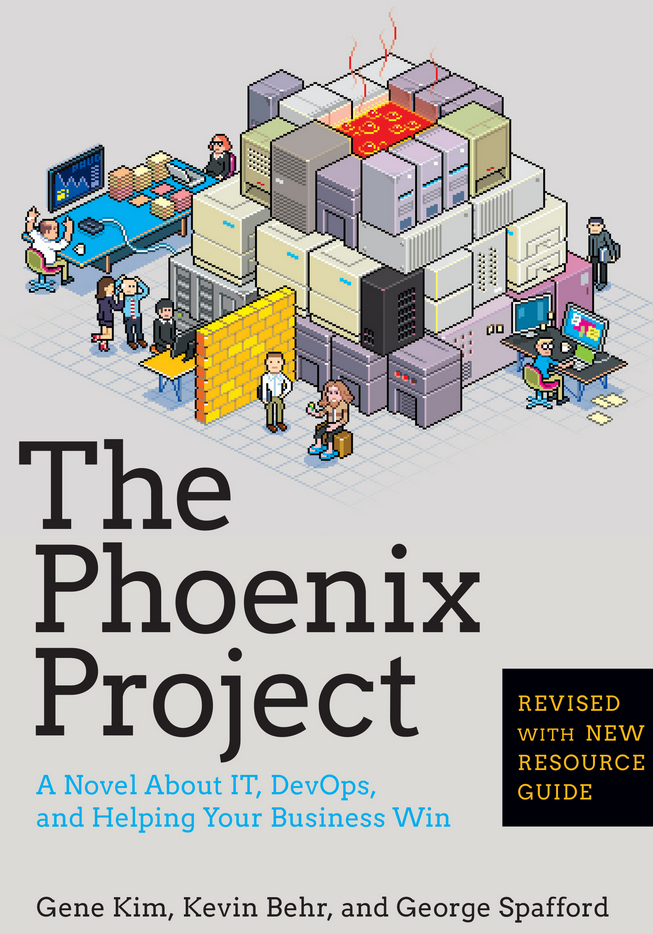

# The Phoenix Project

It should be possible to resume this book by "The story of a project on fire".

Until the second half of the book, it's just the _highway to hell_ for an IT project: Bill Palmer is promoted from Head of Operations to Head of Department.
His first day starts with a big failure, due to obfuscation of information in a database, followed by bigger and bigger problems, related to a project that is already 3 year late and 20M$ out-of-scope.

Each issue is analyzed and solutions are always proposed, and they all point to the DevOps trend, which tries to have the lowest **Time to market** possible.
For this to happen, the only solution is to drop big releases that contain a lot of functionnalities, but only hit market every 9 or 12 months, and focus on small and incremental improvments.
Each of these improvments concerns a specific topic in the organization:

* Team management
* Technical debt
* Moving parts
* Infrastructure and developments
* Information flow

## Team management

### Organization

Teams need short and quick cycle times to continually integrate feedback from business or market places (- for example, through A/B testing).
A great team performs best when they practice repetetively:

* Practice creates habits,
* Habits creates astery of any process or skill,
* Repetition, especially for things that require teamwork, creats trust and transparency (p. 275).

### Dysfunctionments

The five dysfunctionments of a team:

1. Absence of trust: "Don't be the idiot that failed because he didn't asked for help" (p. 336)
2. Fear of conflict
3. Lack of commitments
4. Avoidance of accountability
5. Inattention to results.

### Unplanned work

> *Unplanned work might be called anti-work, since it further highlights its destructive and available nature.*
> *That's why it's so important to know where unplanned work comes from*. (p. 161)

Unplanned work will draw back every other task that need to be done to help the business.
The role of the manager is to ensure the fast, predicatable and uninterrupted flow of planned work that delivers value to the business, while minimizing disruption of unplanned work.
This will provide stable, predicatable and secure IT service. (*p. 91*)

## Technical debt

> People think that just because IT doesn't use motor oil and carry physical packages, that it doesn't need preventive maintenance. Because the work and the cargo that IT carries is invisible.
> Preventing oil changes and vehicules maintenance policies are like preventive vendor patches and change management policies.

Technical debt comes from taking shortcuts, which may make sense in the short term, but like financial debt, the compounding interest costs grow over time: **if an organization doesn't pay down its technical debt, every calory in the organization can be spent just paying interest, in the form of unplanned work**. (p. 195)

**Unplaned work kills your ability to do planned work**.

## Moving parts

> By reducing the number of projects in flight, we are keeping lanes of work. (p. 275)

In order to control the system, we need to reduce the number of moving parts: work in progress must go out of the dashboard - either because it is finised, or because it is waiting -, and as it will progressively go out, due date performance will go up!

For tasks to being closed, services requests need to be documented exactly the as the steps are, what resources can execute them and how long each operation will take.
The objective of these steps is not to show that the IT department will screw less often, but to help every other department reach its goals.

There are three internal control objectives (p. 252):

1. Assurance for reliability of financial reporting
2. Compliance with laws and regulations
3. Efficiency and effectiveness of operations.

## Infrastructure and developments

> Until code is in production, no value is actually being generated, because it's merely work in progress stuck in the system.

1. Infrastructure should be treated as code, so that environments creation may be integrated right into the development process.
2. Months before the product launch, the code is already in production. It's merely a flag toggled and it's already tested by internal uses/testers" (*p. 352*)
3. See also ITIL (*Information Technology Infrastructure Library*), that encapsulate automation around change, configuration and release management.

## Information flow

> When I see work going backward, I think 'waste'. It might be of defects, lack of specification, rework, ... **Regardless, it's something we should fix**." (p. 285)

In any system of work, the theoretical ideal is single-piece flow, which maximize throughput and minimizes variance.
The flow of work should ideally go in one direction: forward.

# The three ways explained

(copié/collé du texte de l'auteur)

The story in the *Phoenix Project* describes the values and philosophies that guide DevOps processes and practices that all DevOps patterns can be derived from, as "The Three Ways".

**The First Way** is about the left-to-right flow of work from Development to IT Operations to the customer.
In order to maximize flow, we need:

1. Small batch sizes and intervals of work,
2. Never passing defects to downstream work centers,
3. To constantly optimize for the global goals (as opposed to local goals, such as feature completion rates, test find/fix ratios, or operations availability measures).

The necessary practices include **continuous build, integration and deployment**, **creating environments on demand**, **limiting work in process**, and **building safe systems and organizations that are safe to change**.

**The Second Way** is about the constant of fast feedback from right-to-left at all stages of the value stream, amplifying it to ensure that we can prevent problems from happening again or enable faster detection and recovery.
By doing this, **we create quality at the source**, by creating or embedding knowledge where we need it.

The necessary practices include:

1. "Stopping the production line" when our builds and tests fail in the deployment pipeline
2. Cconstantly elevating the improvement of daily work over daily work,
3. Creating fast automated test suites to ensure that code is always in a potentially deployable state,
4. Creating shared goals and shared pain between Development and IT Operations,
5. Creating pervasive production telemetry so that everyone can see whether code and environments are operating as designed and that customuer goals are being met.

**The Third Way** is about creating a culture that fosters two things:

1. Continual experimentation, which requires taking risks and learning from success and failure,
2. Understanding that repetition and practice is the prerequisitive to mastery.

Experimentation and risk taking are what enable us to relentlessly improve our system of work, which often requires us to do things very differently than how we-ve it for decades.
And when things go wrong, our constant repetition and daily practice is what allows us to have the skills and habits that enable us to retreat back to a place of safety and resume normal operations.

The necessary practices include creating a culture of innovation and risk taking (as opposed to fear and mindless order taking) and high trust (as opposed to low trust, command-and-control), allocating at least twenty percent of Development and IT Operations cycles towards non-functional requirements, and constant reinforcements that improvements are encouraged and celebrated.
